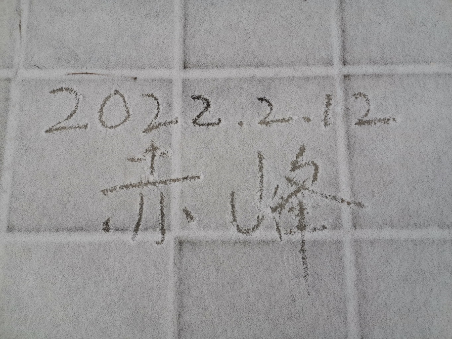

# 雪后漫步昭乌达

## 1. 三十七里的起点

内蒙古东南部的群山之间，锡伯河、半支箭河、阴河、英金河、昭苏河的交汇处，有一座城市叫赤峰，别名昭乌达。在这座城市以西一百公里处，巍峨的七老图山脉和大兴安岭山脉挡住了内蒙古高原的酷寒，但也同样使赤峰冬季异常少雪。隆冬季节，常常二十天，一个月，甚至两个月见不到一点雪花，即使见到雪花也可能只下薄薄一层雪，甚至仅仅飘落几片雪，大多数的日子里都是晴空万里，阳光普照。因此，即使赤峰在寒冷的北方，雪也同样令人激动。2022年2月12日早晨开始，一场小雪来临，当晚停了一段时间后，更大的一波雪到来，一直下到14日早晨。14日下午，天气放晴，我决定好好地游览一番，欣赏这座生活了十四年的城市雪后的样子。这条路线将近十九公里，对我来说，既是一次旅行，也是一个挑战。

.jpg)

> 图片分别为2月12日、13日于雪中拍摄

## 2. 白色的世界

锡伯河，是一条在地图上难以找到的、仅一百多公里长的小河。它发源于七老图山上，在赤峰城区汇入英金河，向东流去，汇入辽河，奔向渤海。在城区里，锡伯河的河道相当宽阔，几百米宽的空旷土地任其流淌。据说，以前发洪水时，河水可以占满整个河道，但平常，河水只流淌在中间那条蜿蜒的小河沟里。冬天，河道中间的河水结了厚厚的冰，“大河上下，顿失滔滔”，而河道其余空地长满的绿草，也变得枯黄，成了土地的颜色。当这场雪来临后，一切都变成了白色，站在桥上看，无论是冰面还是土地，颜色都相同了。雪刚刚下过，那些积雪没有留下太多脚印，仍是蓬松、平整的，看上去就像一层白色的棉被。

除了地上白，天上也同样有白色。下过雪后未散去的白云，比冬季其他日子的云看上去都低得多，比平常那种轻飘飘的卷云也好看得多，看上去更有云朵的质感。午后的太阳光看起来也是白色的，此时的锡伯河边，白色绝对是主导的颜色。

.jpg)

.jpg)

.jpg)

## 3. 临河公园

从锡伯河与阴河汇入英金河的地方向北走，不远就到了阴河西岸的临河公园，也叫廉政园。比起这座公园的人文内涵，我更喜欢的是它的自然环境。公园里生长着参天的杨树，冬天，成千上万的树叶落入土地，又被“白棉被”覆盖。唯一的绿色是松树带来的，绿色之间的白点，近看才发现是雪落在了松塔上、树枝上。原本地面上有土地、有小路、还有两条黑白围棋子组成的“棋子路”，在雪中远看全部成了同一种颜色。

.jpg)

.jpg)

.jpg)

.jpg)

## 4. 银河大桥与姚家洼

出了临河公园，要前往下一站了。途中经过横跨在阴河之上的银河大桥。这座桥的中央立着一座巨大的“月亮”，成为赤峰的地标性建筑。桥对岸再往北走，有一座小山包。这里有“姚家洼遗址”，免于在城市建设过程中被推平。大约十米高的山顶，是观看银河大桥的一个绝佳地点。天气好的时候，姚家洼是周边居民的一个公园，而这雪天里，山顶上没看见人。

.jpg)

.jpg)

## 5. 哈达和硕公园

下山再向北走一段距离，就能看到另一座山，上面长满了墨绿色的松树，这便是哈达和硕公园了。哈达和硕公园面积54万平方米，是在原来油松林的基础上建成的。整个公园呈南北细长型，被中昊街、友谊大街分成三部分，这两条街上方的“松影回廊”天桥把三部分连接在一起。公园最北端有一座“油松塔”，高四层，形似松果，站在最高层便可将整个公园及周围的城市尽收眼底。一路从公园过来，对公园也就不足为奇。但站在上面，望见红山，着实令我震惊。红山是“赤峰”地名的由来，在城市东部，英金河畔，这座红色的山峰赤峰人早已看惯。然而，下过雪后，红山看上去棱角更分明了。不知为什么，山与雪的组合，总会让人感觉更加壮观——或许是因为联想到宏伟的喜马拉雅山吧。

.jpg)

.jpg)

.jpg)

.jpg)

.jpg)

.jpg)

.jpg)

## 6. 乌兰哈达公园

.jpg)

乌兰哈达就是“赤峰”“红山”的蒙语音译，它与哈达和硕公园就像双胞胎：哈达和硕公园有两段松影回廊，乌兰哈达公园就有一座长的“哈达桥”；哈达和硕公园是油松林，乌兰哈达公园则是樟子松林；哈达和硕公园有四层油松塔，乌兰哈达公园则有五层松果塔；哈达和硕公园在桥北物流园区西边，与阴河相邻，而乌兰哈达公园在桥北物流园区东边，与英金河相邻；哈达和硕公园分三部分，乌兰哈达公园目前分两部分，但将来也可能有三部分；两座公园的设施风格几乎相同；甚至两座公园都是在2020年十一开园。

穿过物流园区，从一个小门进了乌兰哈达公园。乌兰哈达公园并不全是松树，也有很多其他新栽的小树，光秃秃的，一眼望去就能看到一大片雪地。向松果塔的方向走去，几乎看不见人，我在空旷无人的园里高声歌唱，想起什么唱什么，停下来不唱，便是一片寂静。登上高塔，这里离红山更近了一步。除了红山之外，赤峰东北方向连绵的低山丘陵都尽收眼底，如果说雪后的红山像是喜马拉雅山，那么这些丘陵就像藏北高原上一座又一座冰达坂。再看另一个方向，乌兰哈达公园也一样成了白色的世界，松树一片一片的，是墨绿色；其他树种交错在松树之间，光秃秃的树干都是棕色，一目了然。看更远的地方，无数工厂都冒着的白烟，都被风吹向同一个方向。

下了松果塔，不远处就能上哈达桥了。哈达桥是穿行在乌兰哈达公园之间的一座天桥，长1767米，起点在南园，跨过城市主干道玉龙大街后，直接进入北园的松林中，蜿蜒着向北，最后到达公园的最北端，形似一条蓝色哈达而得名。走在哈达桥上，一直望着东边的红山，好像怎么看也看不够。一直想找一个最好的角度将这雪后的红山放入相框里。就这样走着走着，走出了乌兰哈达公园，又回到了喧嚣的城市。

.jpg)

.jpg)

.jpg)

.jpg)

.jpg)

.jpg)

.jpg)

## 7. 返程

从下午一点半出发，到现在已经四点半了。阳光不再是雪一样的白色，渐渐有了黄色，变得柔和了许多。走到这里已经有二十七里，还差最后十里路，就能到家了。先向南过清河大桥，这又是一个看红山的好地方。过桥也意味着回到了老城，回到了锡伯河、英金河的南岸。

沿河向西走，便可观赏这雪后日落了。与平日不同，这日落似乎更加柔和，金黄色的夕阳照在雪地上，使白色的世界染上了一层金黄。这雪地、雪山……有一种雪后独有的感觉。这种感觉貌似来自于对一个地方的印象，是大兴安岭？长白山？是西伯利亚？阿拉斯加？可这些地方的雪景都未曾亲身经历过。或许，这就是赤峰，是数年前一场雪后的赤峰，成为了我对这一景色最初的印象。这洁白的雪，的确是有魔力的。

.jpg)

.jpg)

.jpg)

.jpg)

.jpg)

.jpg)

.jpg)

.jpg)

.jpg)

## 附 三十七里路线

.jpg)

**点赞、收藏、在看  鼓励原创**

**关注公众号获取更多精彩内容**

<Copyright type="passage" :copyright="{author:'土逗', editor:'张新越', time:'2022年2月15日',needCP:true }" :info="['一审：土逗']" ></Copyright>

